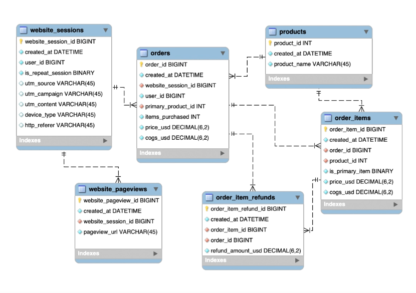

## Introduction

An SQL analysis of a company's trended performance data, telling the story of the company's growth, can help the CEO craft a story about a data-driven company that has been producing rapid growth. Analysing the traffic and website performance data is important in order to show how the company able to produce growth. By diving in to the marketing channel activities and the website improvements that have contributed to the company success to date, it can show to the stakeholder that the company is a serious data-driven shop.

Data visualization with matplotlib, seaborn, numpy and pandas enable a more efficient way to correlate the operations to the company's performance improvement just in a glance. 

Lastly, data modelling with machine learning method help the company in making decision what operations can result in better company's performance by predicting its potential sales.

### Tools used in this project

* 
* 
* 
* 
* 
* 
* 

### Datasets used
The dataset provided with the MySQL Advanced Course by [Maven](https://www.mavenanalytics.io/) analyzed the sales of Maven Fuzzy Factory, and was specifically adjusted for the Bootcamp in 2022 from [Udemy](https://www.udemy.com/course/advanced-sql-mysql-for-analytics-business-intelligence/) to aid students practice SQL skills with a project. 

We will be working with six related tables, which contain eCommerce data about:
+ Website Activity
+ Products
+ Orders and Refunds
We will use MySQL to understand how customers access and interact with the site, analyse landing page performance and conversion, and explore product-level sales.

### Entity Relationship Diagram

### Data Visualization in Python
Python data visualization methods via matplotlib, seaborn, numpy and pandas to present the results in the MySQL Advanced Course by [Maven](https://www.mavenanalytics.io/)  
  *  Company order volume and website session growth by quarter.
  *  Quarterly figures for conversion rate, revenue per order, and revenue per session.
  *  Quarterly view of orders from specific channels.
  *  Session-to-order conversion rate trends for specific channels by quarter.
  *  Monthly trending for revenue, margin, total sales, and seasonality.
  *  Monthly sessions to /products page and conversion rates.
  *  Sales data and cross-selling analysis since December 05, 2014

<!-- MARKDOWN LINKS -->
[Maven-url]:https://www.mavenanalytics.io/
[Udemy-SQLcourse-url]:https://www.udemy.com/course/advanced-sql-mysql-for-analytics-business-intelligence/ 

